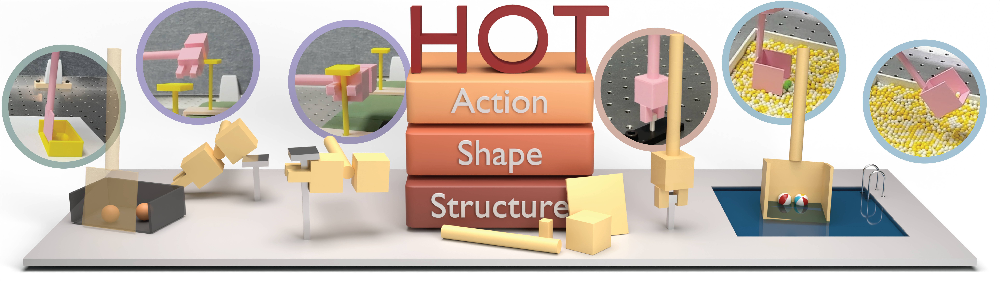

# Robot Tool Design from Scratch via Behavior-Aware Hierarchical Optimization

**HOT: Hierarchical Optimization for Tool design**

<b>Yinghan Chen <sup>\*</sup>, Xiyao Tian <sup>\*</sup>, Yizan Dai <sup></sup>, Yuyang Li <sup>†</sup>, and Yixin Zhu <sup>†</sup></b>

<sup>*</sup> Equal contributors · <sup>†</sup> Corresponding authors


[🌐 Project website](https://hot.yinghanchen.com) |
[📹 Video](https://player.vimeo.com/video/1230686259)



This repository releases the HOT codebase, tool assets, task definitions, saved examples, and a structural search demo. HOT designs a tool from a desired physical outcome: it searches over assemblies of primitive components, optimizes how each candidate is used in simulation, and refines the shape and action of successful designs.

## Codebase structure

| Path | Contents |
| --- | --- |
| [`assets/`](assets/) | Primitive library and asset generation |
| [`bilevel/`](bilevel/) | BASS structural search, physical evaluation, and shape/action refinement |
| [`core/`](core/) | Bundled differentiable simulator |
| [`replay_examples/`](replay_examples/) | Saved Stage 1 and Stage 2 tool designs and rollouts |
| [`search_demo/`](search_demo/README.md) | Runnable structural search demo, supplied DAG, and calibration artifacts |
| [`tasks/`](tasks/README.md) | SweepBalls, TorqueBolt, ScoopBalls, and Hammer&ExtractNail task definitions |

## Install

Use Linux with a C++ compiler, make, and OpenGL and X11 development libraries. The Conda environment pins a CMake version compatible with the bundled simulator. From the repository root, run:

```bash
conda env create -f environment.yml
conda activate hot
(cd core && python setup.py build_ext --inplace)
PYTHONPATH=core python -c 'import redmax_py; print(redmax_py.__file__)'
```

## Replay saved tools

Run these commands from the repository root with the `hot` environment active. Each task has two saved examples: Stage 1 uses the original shape, and Stage 2 uses the refined shape. The commands below open interactive playback and write no files. Stage 2 is the default.

**SweepBalls**

```bash
python replay_example.py --task sweep_balls --stage stage1
python replay_example.py --task sweep_balls --stage stage2
```

**TorqueBolt**

```bash
python replay_example.py --task torque_bolt --stage stage1
python replay_example.py --task torque_bolt --stage stage2
```

**ScoopBalls**

```bash
python replay_example.py --task scoop_balls --stage stage1
python replay_example.py --task scoop_balls --stage stage2
```

**Hammer&ExtractNail**

```bash
python replay_example.py --task hammer_extract_nail --stage stage1
python replay_example.py --task hammer_extract_nail --stage stage2
```

Interactive playback requires a desktop display. Add `--verify-only` to verify an example without a viewer, or `--speed 1 --once` to play once at normal speed. Replay checks the objective, final state, deformation and task success. Verify all eight saved examples without opening a viewer:

```bash
python replay_example.py --all
```

## Optimize the reference tools

Run each task's two commands in order, starting Stage 2 after Stage 1 succeeds. Stage 1 optimizes actions with the reference shape fixed. Stage 2 starts from the saved Stage 1 actions and refines shape and action. The reference model, optimizer settings and iteration budgets come from the task defaults; no DAG download is required.

**SweepBalls**

```bash
python run_main.py --task sweep_balls --save-dir workspace/sweep_balls/stage1
python run_main.py --task sweep_balls --design-optim --initial-action workspace/sweep_balls/stage1 --save-dir workspace/sweep_balls/stage2
```

**TorqueBolt**

```bash
python run_main.py --task torque_bolt --save-dir workspace/torque_bolt/stage1
python run_main.py --task torque_bolt --design-optim --initial-action workspace/torque_bolt/stage1 --save-dir workspace/torque_bolt/stage2
```

**ScoopBalls**

```bash
python run_main.py --task scoop_balls --save-dir workspace/scoop_balls/stage1
python run_main.py --task scoop_balls --design-optim --initial-action workspace/scoop_balls/stage1 --save-dir workspace/scoop_balls/stage2
```

**Hammer&ExtractNail**

```bash
python run_main.py --task hammer_extract_nail --save-dir workspace/hammer_extract_nail/stage1
python run_main.py --task hammer_extract_nail --design-optim --initial-action workspace/hammer_extract_nail/stage1 --save-dir workspace/hammer_extract_nail/stage2
```

Optimization runs without a viewer by default and saves parameters, optimization history and diagnostics under `workspace/<task>/stage1/` and `stage2/`. Check `task_success` in each stage's `diagnostics.json`. To keep multiple runs, choose new output directories and update Stage 2's `--initial-action` accordingly. Fresh optimization may produce different results from the saved examples; Stage 2 may retain the Stage 1 result without improvement.

**Reproducibility across machines:** Differences in processor architectures and numerical libraries can introduce small floating-point differences in the simulator. These differences can accumulate through contact simulation and optimization, leading to different loss values, optimized shapes, and action trajectories even with the same settings and random seed. Exact numerical agreement across machines is therefore not guaranteed. For fresh runs, physical task success (`task_success`) is the primary outcome to check. BASS uses task progress and success signals to guide structural search toward designs that complete the task.

## Run the structural search demo

The [demo guide](search_demo/README.md) covers three starting points: build a canonical structural DAG, run physical calibration, or search with the supplied DAG and calibration artifacts. The precomputed DAG is optional (approximately 1.4 GiB) and is excluded from automatic Git LFS downloads by default. Saved-example replay and reference-tool optimization do not require it. To calibrate or search with the supplied DAG, install Git LFS and download it explicitly:

```bash
git lfs pull --include="search_demo/dags/demo_dag/**" --exclude=""
```

To run BASS on SweepBalls with the supplied artifacts:

```bash
python search_demo/run.py --mode search --workers 4
```

The supplied 9,800 calibration outcomes are replayed into BASS before guided evaluation. Search defaults to `--evaluations -1`, which places no evaluation cap on guided search; it runs until stopped or the DAG is exhausted. Set a positive `--evaluations` value to cap new guided candidate evaluations. To build a DAG or generate calibration artifacts yourself:

```bash
python search_demo/run.py --mode build
python search_demo/run.py --mode calibrate
```

The demo defaults to three Head links, one functional group, the full asset library, and 9,800 calibration runs. See `python search_demo/run.py --help` for task, budget, and output options. The [demo guide](search_demo/README.md) explains each command and its artifacts.

## Citation

If you find our work helpful, please consider citing it: 

```bibtex
@misc{chen2026hot,
  title  = {Robot Tool Design from Scratch via Behavior-Aware Hierarchical Optimization},
  author = {Chen, Yinghan and Tian, Xiyao and Dai, Yizan and Li, Yuyang and Zhu, Yixin},
  year   = {2026}
}
```

HOT is released under the [MIT License](LICENSE). See [third-party notices](THIRD_PARTY.md) for bundled dependencies.
